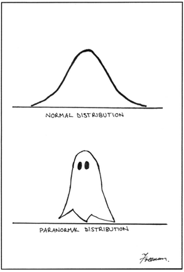

*Andy, Kevin, and Jason want you to know that this write-up can also be found in /docs/paper/report.pdf*

This README-slash-report was last updated June 6, 2013.

# 36-462 Special Topics: Data Mining

## Final Report by Chung, Gilbert, & Sun

## Abstract

The purpose of this study is to accurately determine the unknown crime levels of neighborhoods in
a city. We first attempt to unveil the underlying structure of the data using principal component
analysis and the k-NN algorithm, but find nothing of value. Using a two-stage algorithm, we first
make predictions using a random forest and then follow-up uncertain predictions with a multinomial
LASSO regression. We obtain a training misclassification rate of 0% and a 4-fold cross-validated
misclassification rate of 31%, whereas applying these methods individually incurs a misclassification
rate of over 40%. After further inspection, we also discover that the data is from the city of
Pittsburgh, Pennsylvania.

## 1: Introduction

We have data on 79 neighborhoods within an unknown city. For each neighborhood, we are given
92 predictor variables such as median income, population, area, and many others. Of the 79
neighborhoods, only 55 of them contain the labels of crime level, with 1 being low, 2 being medium,
and 3 being high crime. In addition to the data set, we also have a pairwise distance matrix of the
geographical distance between each neighborhood. Our research goal is to predict the remaining
(withheld) crime levels for the 24 neighborhoods as accurately as possible. We have two basic
approaches to predicting crime: geographical and statistical.

One of the foremost concepts that our group wanted to investigate was “crime spillover", a basic
idea that crime in one neighborhood should be correlated with crime in adjacent neighborhoods.
As outlined in a later section, this method is quite naive. Our superior method utilizes as much
information from the datset as possible in a “random forest"

## 2: Unsupervised Analysis

Noting that there are significantly more variables than the number of known crime observations,
our first step is to necessarily reduce the dimension of our solution space. If we attempt to use
every predictor variable, we would have no degrees of freedom with which to interpret our results.
Furthermore, we also note that there is high correlation among the given variables, such as the
% Vacant Units and % Occupied Units, which basically display the same information and are
perfectly correlated with each other. To counter multicolinearity within the predictor variables and
to reduce dimensions, we first decided to run **principal component analysis** as it converts the
set of possibly correlated observations into a set of linearly uncorrelated values. Using the cutoff of
99% of cumulative variance, we found the first five principal components to be sufficient. However,
we were unable to derive any group structure from this information. In order for these components
to be predictively powerful, we would need to be able to leverage them in one of our models. What
we find is that PCA does not give any visible structure to work with in the data.

Next, we utilized the pairwise distance matrix supplemented in the data set. Scaling the matrix
in two dimensions can give us the relative plot of the neighborhoods in the data. After a little
bit of manipulation (scaling, rotation, and translation, most importantly inverting the y-axis), we
ended up staring at a plot that was similar to the shape of Pittsburgh. Overlaying our plot to an
actual map of Pittsburgh (source: Wikipedia) gave us further insight into our models. Specifically,
it caused us to eliminate k-NN from consideration.

Essentially, a k-NN algorithm would allow us to classify crime levels according to nearby neighbor-
hoods. This idea only uses geographical parameters to determine Euclidean “distance" between
nodes. Unfortunately, even at the best accuracy rate, shared by very small k = 2 and very high
k = 13, k-NN was unable to provide the kind of accuracy that we desired. The deficiency should
be apparent if we think about the information available to us. Firstly, although neighborhoods are
often near other neighborhoods of similar crime, there are no obvious centroids of crime. Thus,
small k is highly prone to local noise, whereas high k is merely following the global trend: most
neighborhoods are low-crime. Now, why is there local noise between neighborhoods? Any resident
of Pittsburgh should know: there are physical boundaries in the city that divide the neighborhoods.
Specifically, the hills and rivers (especially the rivers) make it so that crime in one neighborhood
is actually very much geographically removed from crime in adjacent neighborhoods.

We would like to note that we did not use this information to our advantage by incorporating it into
our actual classification method for predicting the missing values. This was just a very interesting
find for us that we did not expect to come across; hence, it warrants mention in the unsupervised
analysis.

## 3: Supervised Analysis

Diving into a model that would be able to utilize the parameters given for each neighborhood, we
moved onto a **random forest** model. This concept is an ensemble method that was mentioned,
though not formally introduced, during this course. A random forest is a bagging method: we take
many, many decision trees and report the classification of the mode of the set of trees, rather than
attempt to construct some sort of “average" or “best" decision tree. Each decision tree in the forest
is trained on a random selection of the features in the dataset. In order to determine the optimal
number of trees to populate our forest, a plot of cross-validation error is given in Figure 5. The
overall out-of-bag error of the random forest levels out after about 100 trees.

Although the random forest has the benefit of a built-in cross-validation method (individual trees
trained on random selection of variables), the forest as a whole is not guaranteed to be perfect, in
any way. In fact, we often find that it is prone to identifying (and then overfitting) patterns in the
data. In particular, our random forest was not very accurate or consistent at predicting training
samples with crime level of 3, with misclassification errors varying from 40% to 90%. On the other
hand, it was extremely good at discerning the difference between low crime and medium crime
errors, sometimes getting error rates below 7% within the fold. We felt that it was necessary to
address our random forest's problem when many trees disagreed with the concensus. Sometimes, a 
particular classification would be selected with only the votes of 40% of the trees, not a majority
but at least a plurality. In these cases, we decided to raise the cutoff. If the forest wasn't certain,
then we would recalculate the observation in question.

Now enters our backup model: the LASSO. Using the `glmnet` package, we trained a generalized
linear model on the available data and tuned it to predict a multinomial set of very few obser-
vations given a very large set of data. Whenever the random forest made a prediction where the
“winning" classification was made without a majority of the total votes, we passed the observation
to the LASSO model and instead reported the back-up prediction. In training the LASSO model,
we choose the regularization parameter that minimized our total error on the set of 55 known
neighborhoods. Then, we would be able to leverage as many points as possible to predict a very
small set of rejected random forest predictions (usually between 0 and 7 in a given fold). A plot of
the CV error given regularization parameter is shown in Figure 6.

## 4: Conclusion

We obtain a 4-fold cross-validated misclassification rate of 31% on our final two-stage model. We
decided that this was a very positive result, because individual methods (such as k-NN, LASSO,
and decision trees) could barely scratch 40% misclassification. Our decision to use 4-folds cross-
validation was based on the proportion of 24 missing values. With four folds, every fold would
make 13 predictions using 42 observations, which is a similar ratio to making 24 predictions using
55 observations. In conclusion, we are quite pleased to predict that crime in the city of Pittsburgh
is most often "low" crime.